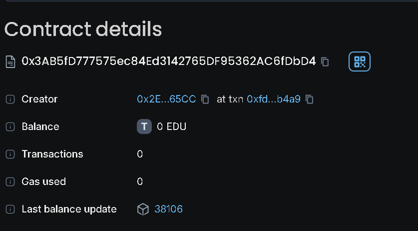

## **BlockchainISA Smart Contract**

This Solidity smart contract represents a blockchain-based Income Share Agreement (ISA) system. It allows students to create ISAs, which can be funded by others, and supports reporting income and requesting refunds.

---


### **Project Vision**

The BlockchainISA project aims to revolutionize educational financing by leveraging blockchain technology to create a transparent, decentralized system for Income Share Agreements. This allows students to receive funding for their education and repay their investors based on their future income, providing a flexible and fair funding model that aligns the interests of both students and investors.

---

### **Features**

1. **Create ISA**:
   - **Function**: `createISA`
   - **Description**: Allows a student to create an ISA with specified funding amount, repayment percentage, income threshold, and duration.
   - **Parameters**:
     - `_fundedAmount`: Amount of funds required.
     - `_repaymentPercentage`: Percentage of income to be repaid.
     - `_incomeThreshold`: Minimum income required to start repayments.
     - `_duration`: Duration of the ISA in seconds.

2. **Fund ISA**:
   - **Function**: `fundISA`
   - **Description**: Allows users to fund an existing ISA.
   - **Parameters**:
     - `_isaId`: ID of the ISA to fund.
     - `_fundingAmount`: Amount of Ether to fund.
   - **Note**: The funding amount must be sent with the transaction and match the specified `_fundingAmount`.

3. **Report Income**:
   - **Function**: `reportIncome`
   - **Description**: Allows the student to report their income and make repayments if the income exceeds the threshold.
   - **Parameters**:
     - `_isaId`: ID of the ISA being reported.
     - `_income`: Reported income amount.

4. **Finalize ISA**:
   - **Function**: `finalizeISA`
   - **Description**: Allows the student or the contract itself to finalize the ISA based on time elapsed or repayment completion.
   - **Parameters**:
     - `_isaId`: ID of the ISA to finalize.

5. **Request Refund**:
   - **Function**: `requestRefund`
   - **Description**: Allows the student to request a refund if the ISA duration has ended and the total repaid amount is less than the funded amount.
   - **Parameters**:
     - `_isaId`: ID of the ISA to request a refund for.

---

### **Usage**

1. **Deploying the Contract**:
   - Deploy the `BlockchainISA` contract using Remix or any Ethereum-compatible development environment.

2. **Creating an ISA**:
   - Call the `createISA` function with the appropriate parameters to create a new ISA.

3. **Funding an ISA**:
   - Call the `fundISA` function with the ISA ID and the amount you want to fund. Ensure the amount of Ether sent matches the funding amount parameter.

4. **Reporting Income**:
   - Use `reportIncome` to report income and make repayments if the income meets the threshold.

5. **Finalizing and Requesting Refund**:
   - Call `finalizeISA` to end the ISA based on time or repayment status.
   - Use `requestRefund` to claim any remaining funds if the ISA duration has ended and repayment is insufficient.

---

### **Project Structure**

```
BlockchainISA/
├── contracts/
│   └── BlockchainISA.sol    # Smart contract source code
├── migrations/
│   └── 1_deploy_contracts.js # Deployment scripts
├── test/
│   └── BlockchainISA.test.js # Test scripts
├── README.md                 # Project documentation
├── LICENSE                   # License file
└── truffle-config.js         # Truffle configuration file
```

- **`contracts/`**: Contains Solidity smart contract code.
- **`migrations/`**: Contains scripts for deploying contracts.
- **`test/`**: Contains test scripts to validate contract functionality.
- **`README.md`**: Project documentation.
- **`LICENSE`**: License details.
- **`truffle-config.js`**: Truffle configuration for network and deployment settings.

---

### **Developer Details**

**Lead Developer**: [Manish Kumar]  
**Email**: [kmanish1773@gamil.com]  
**GitHub**: [https://github.com/manishiitmandi]

## Deployement details
Chain name: Educhain Open Campus
contract id:0x3ab5fd777575ec84ed3142765df95362ac6fdbd4





### **Icons**


---


